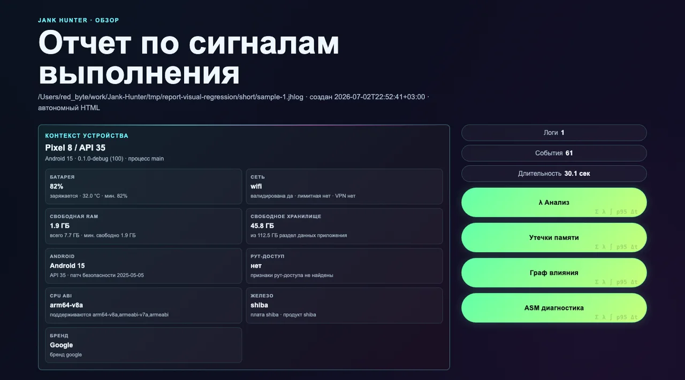
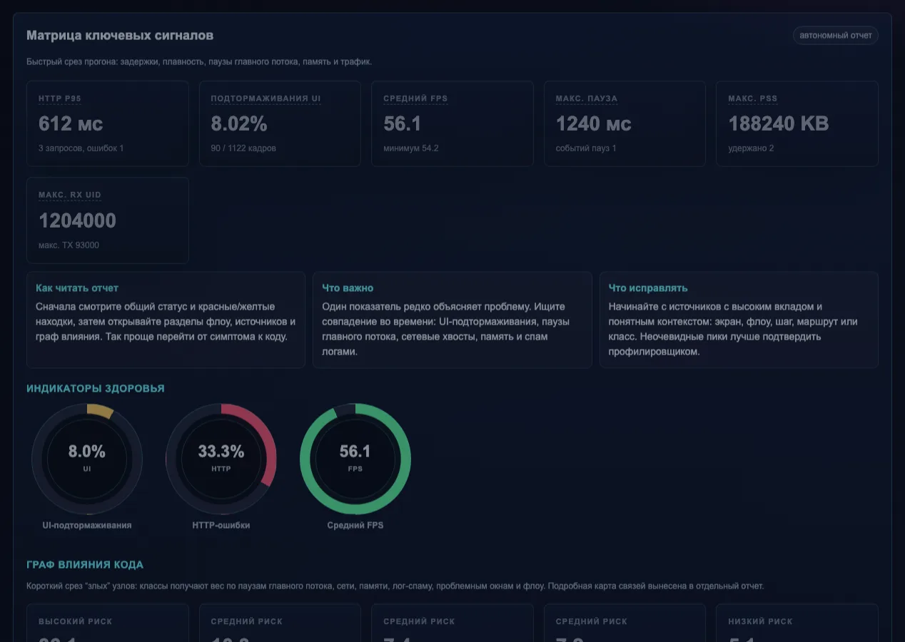
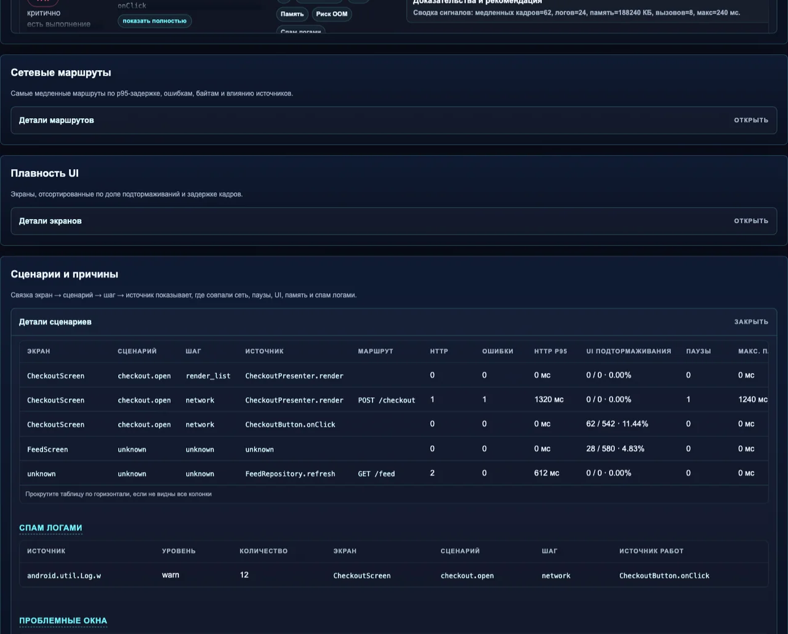
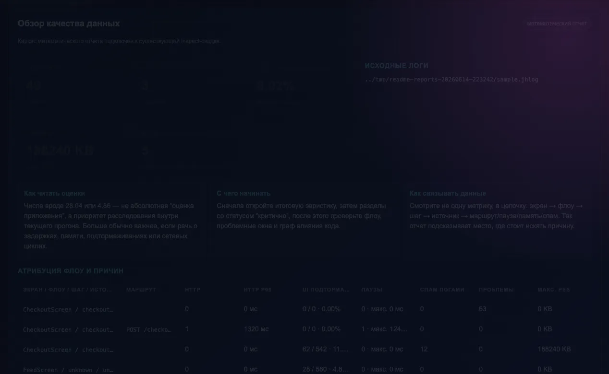
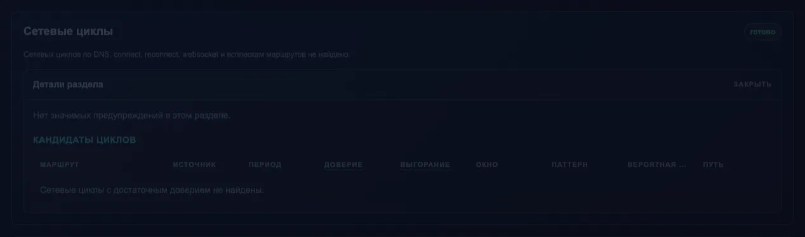
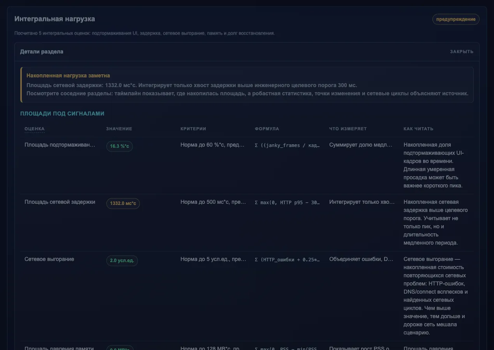
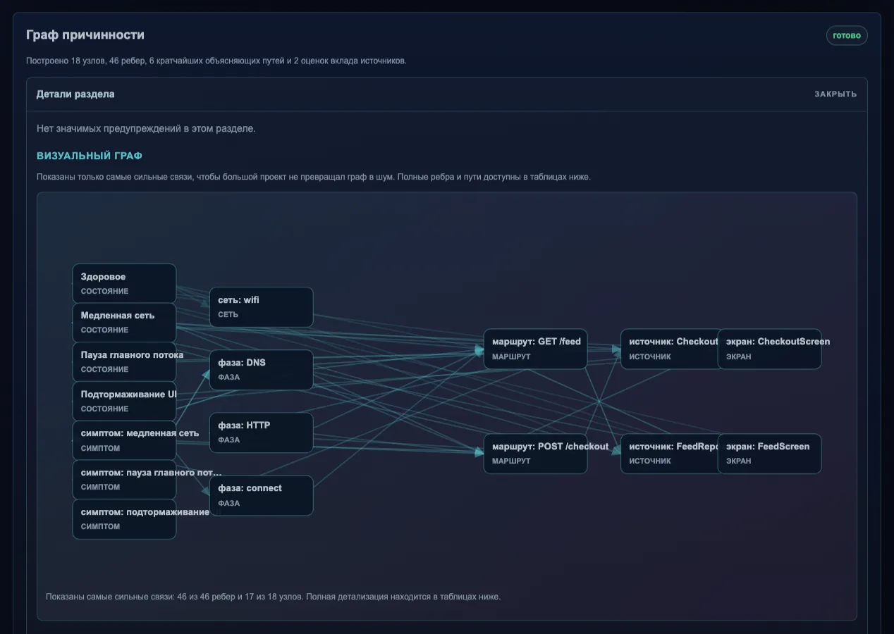
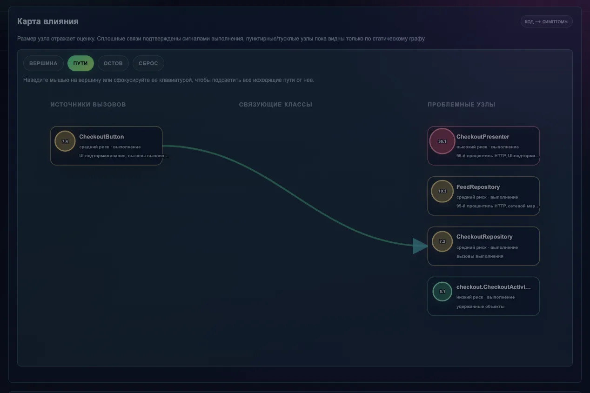
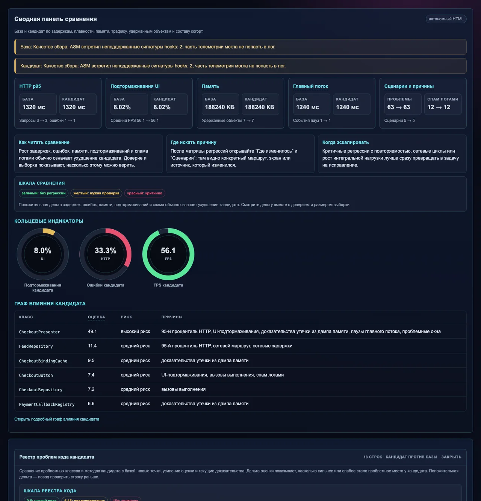

# Jank Hunter

Jank Hunter помогает поймать то, что обычно сложно доказать словами: дерганый UI, длинные паузы главного потока, медленную сеть, рост памяти, удержанные объекты, слишком шумные логи и странные различия между двумя сборками.

Идея простая: Android-приложение пишет компактный `.jhlog`, а CLI на машине разработчика превращает его в нормальный HTML-отчет. Без сервера, без базы, без загрузки данных наружу.

## Что внутри

- `android/` - Android runtime, OkHttp-интеграция, Gradle plugin с ASM-инструментацией и sample app.
- `cli/` - утилита `jankhunter`, которая читает `.jhlog`, строит inspect/compare отчеты, экспортирует JSONL и умеет работать в CI.

Отчеты автономные: обычный HTML с CSS внутри. Их можно открыть локально, приложить к задаче, положить в CI artifacts или отправить команде.

## Как выглядят отчеты

Скриншоты ниже сняты с тестового `.jhlog`, который генерируется командой `jankhunter sample`. Это не мокапы: такие же HTML-файлы CLI кладет рядом с реальным логом.

### Основной отчет

Первый экран показывает контекст устройства, длительность прогона, быстрые действия и общую рамку отчета.



Матрица ключевых сигналов дает быстрый срез по сети, UI, памяти, паузам главного потока и трафику.



Раздел флоу связывает экран, пользовательский сценарий, шаг, источник работ и симптомы. Он нужен, чтобы не просто увидеть просадку, а понять, где она проявилась.



### Математический анализ

Математический отчет открывается из основного отчета кнопкой `λ Анализ`. Вверху он собирает качество данных, главные риски и подсказки, куда смотреть дальше.



Сетевые циклы ищут повторяющуюся сетевую активность, которая может разгонять задержки, батарею, трафик и нагрузку на приложение.



Интегральная нагрузка показывает не только пик, а накопленную “площадь” проблемы во времени: UI-подтормаживания, сетевые хвосты, давление памяти и долг восстановления.



Граф причинности связывает симптомы, маршруты, фазы сети, источники работ и экраны. Он помогает пройти от “что болит” к “где искать код”.



### Граф влияния кода

Отдельный отчет по влиянию показывает проблемные классы и связи между ними. Узлы можно выделять: отчет подсветит связанные пути, соседей и остов.



### Сравнение прогонов

`compare` нужен для проверки регрессий между baseline и candidate. Он показывает, какие сигналы изменились, насколько им можно доверять и где искать источник отличий.



## Быстрый старт CLI

```bash
cd cli
make build
./bin/jankhunter sample --out /tmp/sample.jhlog
./bin/jankhunter inspect /tmp/sample.jhlog --out /tmp/jankhunter-report.html
./bin/jankhunter compare --baseline /tmp/sample.jhlog --candidate /tmp/sample.jhlog --out /tmp/jankhunter-compare.html
```

`make build` сам скачает Go в `cli/.tools/go`, если Go не найден в системе. После сборки бинарник лежит в `cli/bin/jankhunter`.

Установка в систему:

```bash
cd cli
make install
```

Если не хочется ставить в `/usr/local/bin`:

```bash
make install PREFIX="$HOME/.local"
```

## Быстрый старт Android

Для локальной проверки можно собрать и запустить sample app:

```bash
./run-sample-app.sh
```

Скрипт поднимет или использует уже запущенный emulator/device, установит sample app и даст интерактивные команды:

```text
log
report
stop
open
help
quit
```

`log` и `stop` вытаскивают `.jhlog` из приложения и генерируют HTML-отчет в `tmp/sample-app-.../pull-.../report.html`. Сам sample теперь работает как Jank Hunter Playground: внутри есть guided baseline/candidate сценарии, Leak Lab, performance lab и переключатель runtime feature flag.

Для своего приложения базовое подключение обычно выглядит так:

```kotlin
dependencies {
    compileOnly("io.jankhunter:jankhunter-annotations:1.0.0")
    debugImplementation("io.jankhunter:jankhunter-runtime:1.0.0")
    debugImplementation("io.jankhunter:jankhunter-okhttp3:1.0.0")
}
```

Gradle plugin подключайте только на debug/QA сборки и сначала ограничивайте include-пакеты. Если проект огромный и перечислять модули больно, есть `includeWholeApplication = true` плюс `excludePackages(...)`. ASM умеет автоматически подключать слушатель OkHttp при `OkHttpClient.Builder.build()` и оборачивать `Handler.post*` так, чтобы `removeCallbacks`, `removeCallbacksAndMessages` и `hasCallbacks` продолжали работать с исходным `Runnable`.

Подробности по Android лежат в [android/README.md](android/README.md), по CLI - в [cli/README.md](cli/README.md).

Автоподключение в существующий Android-проект на macOS:

```bash
scripts/integrate-android-project.sh ~/work/MyApp
```

Если нужно сразу сузить ASM и включить runtime-граф вызовов:

```bash
scripts/integrate-android-project.sh \
  --target ~/work/MyApp \
  --module :app \
  --include-package com.myapp.feature \
  --include-package com.myapp.data \
  --exclude-packages com.myapp.generated,com.myapp.di \
  --runtime-call-graph
```

Скрипт публикует Android-артефакты Jank Hunter в `~/work/MyApp/.jankhunter/maven`, собирает CLI в `~/work/MyApp/.jankhunter/bin/jankhunter`, добавляет Maven repo в `settings.gradle(.kts)`, прописывает `sdk.dir` в `local.properties`, подключает Gradle plugin/dependencies в найденный app-модуль и создает `jankHunter { ... }` конфиг. App-модуль определяется автоматически: скрипт ранжирует кандидатов по Android application plugin или alias, launchable manifest, manifest `android:name`, `Application` subclass, `applicationId`, совпадению с именем проекта, имени модуля и отбрасывает вниз test/benchmark/sample-модули. Перед публикацией он также передает найденный Android SDK и установленную версию Build Tools в Gradle-сборку Jank Hunter, поэтому чистый clone без `ANDROID_HOME` тоже должен собраться на macOS. Перед правками целевого проекта скрипт оставляет backup в `.jankhunter-backups/`.

Если Android SDK лежит не в стандартном месте, передайте путь явно:

```bash
scripts/integrate-android-project.sh ~/work/MyApp --android-sdk "$ANDROID_HOME"
```

Если нужно зафиксировать конкретную установленную версию Build Tools:

```bash
scripts/integrate-android-project.sh ~/work/MyApp --android-build-tools 35.0.0
```

## Что собирается

- HTTP: длительность запроса, DNS/connect/TTFB, ошибки, байты, route, owner.
- UI: FPS, доля медленных кадров, p95/p99 кадра, экраны.
- Главный поток: длинные паузы и источники работ.
- Память: PSS, Java/native heap, свободная RAM, retained objects и опциональный HPROF/heap evidence для пути до GC root, holder field и retained size.
- Контекст устройства: Android/API/security patch, ABI, сеть/VPN, батарея, storage, рут-доступ.
- Пользовательские counters/gauges.
- Owner attribution: ручной `JankHunter.withOwner(...)`, ASM-generated owners и lightweight-аннотации `@JankOwner` / `@JankIgnore`.
- Граф влияния кода: классы, флоу, проблемные окна, лог-спам, runtime-вызовы и build-time ASM-связи между классами.
- ASM-интеграция: rule/spec/intent pipeline для OkHttp/WebSocket, Handler, Executor, builders корутин, click-flow, log spam и статического class graph.

CLI строит два основных режима:

- `inspect` - один лог или набор логов, чтобы понять текущий прогон.
- `compare` - baseline против candidate, чтобы увидеть регрессии, когорты и конкретные места, где стало хуже.

Рядом с основным HTML создаются дополнительные автономные страницы: `report-math.html` / `compare-math.html`, `report-leaks.html` / `compare-leaks.html`, а при наличии owner/flow-сигналов еще `report-influence.html` / `compare-influence.html`. Отчет утечек работает в light mode без HPROF и автоматически переходит в heap mode при `--heap-dump` или `--heap-evidence`: там появляется Leak Explorer с цепочкой GC root -> holder -> retained object, alternative paths, чеклистом расследования, chain fingerprint и сравнением new/worse/same/better/resolved.

## Релизы

GitHub Actions собирает релиз по тегу `v*` или вручную из workflow `Release`.

```bash
git tag v1.0.0
git push origin v1.0.0
```

В GitHub Release попадают:

- `jankhunter-android-sdk-<version>-maven.zip` - локальный Maven-репозиторий с annotations, runtime, OkHttp-интеграцией, Gradle plugin и plugin marker;
- `jankhunter_<version>_darwin_amd64.tar.gz` - CLI для macOS Intel;
- `jankhunter_<version>_darwin_arm64.tar.gz` - CLI для macOS Apple Silicon;
- `checksums.txt` - SHA-256 суммы релизных файлов.

Для ручного релиза откройте `Actions -> Release -> Run workflow` и укажите версию без `v`, например `1.0.0`.

## Проверки

CLI:

```bash
cd cli
make test
```

Android:

```bash
cd android
./gradlew detekt :jankhunter-gradle-plugin:test :jankhunter-okhttp3:testDebugUnitTest :jankhunter-runtime:testDebugUnitTest :sample-app:assembleDebug --no-daemon
```

Gradle plugin как внешний потребитель через локальный Maven:

```bash
scripts/gradle-plugin-smoke.sh
```

End-to-end через emulator/device:

```bash
./scripts/android-e2e.sh
```

Он собирает sample app, запускает instrumentation test, вытаскивает `.jhlog` и кладет отчет в:

```text
reports/android-e2e/report.html
```

## Важные принципы

- Не грузить приложение тяжелой диагностикой на каждом событии.
- Писать high-frequency данные агрегатами.
- Держать runtime без лишних зависимостей.
- Все спорное включать явно: ASM, корутины, JankStats, release-сборки.
- Сначала компактный машинный лог, потом удобный человеческий отчет на стороне CLI.
