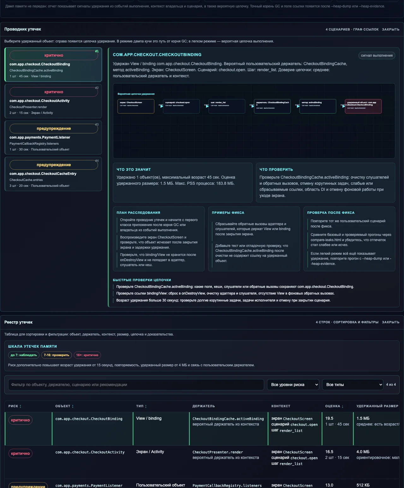
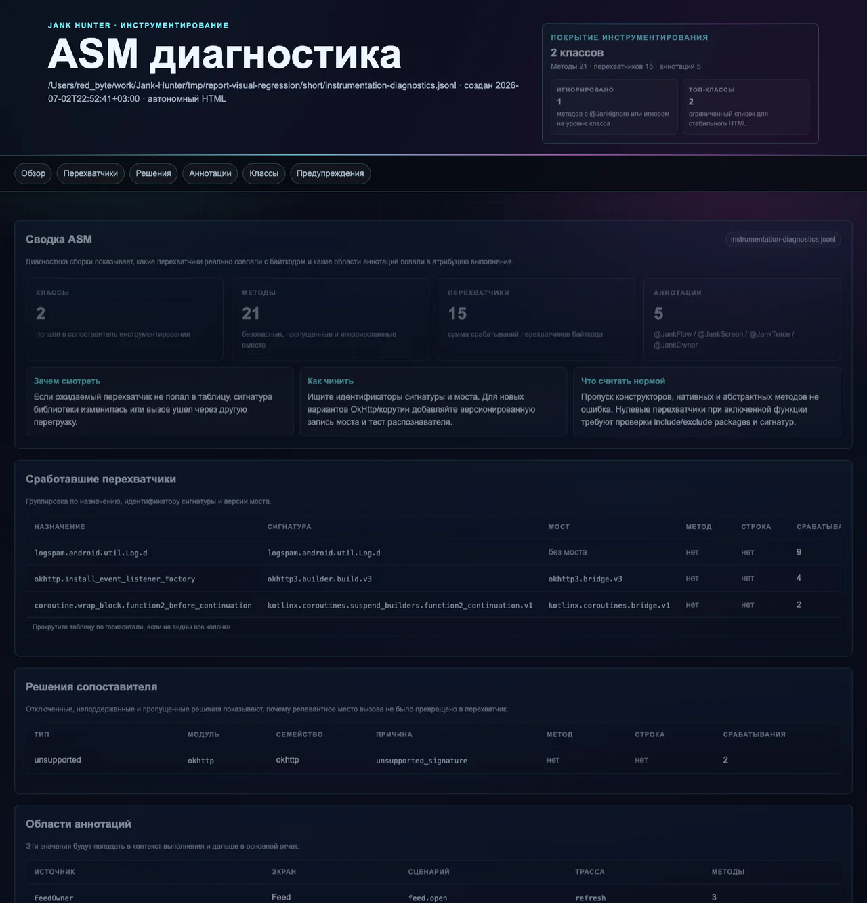

# Jank Hunter

Jank Hunter помогает поймать то, что обычно ускользает в стиле «у меня всё плавно»: рывки интерфейса, длинные паузы главного потока, медленную сеть, рост памяти, удержанные объекты, шумные логи и регрессии между двумя прогонами.

Схема простая. Android-приложение пишет компактный `.jhlog`, а локальная утилита `jankhunter` превращает его в набор автономных HTML-отчётов. Сервер не нужен, база не нужна, данные никуда не отправляются. Всё остаётся на машине разработчика или в файлах проверки сборки. Почти как гравицапа, только без необходимости искать чатланина с визой.

## Что В Репозитории

- `android/`: единый Android SDK-артефакт, runtime, аннотации, интеграция с OkHttp, Gradle-плагин с ASM-внедрением и пример приложения.
- `cli/`: утилита `jankhunter`, которая читает `.jhlog`, строит отчёты, выгружает таблицы проблем и выдаёт оценку готовности для проверок.
- `plugin-as/`: плагин для Android Studio и IntelliJ IDEA. Он запускает `jankhunter`, подтягивает логи с устройства, открывает отчёты и показывает таблицу проблем с переходом в исходники.
- `scripts/`: помощники для подключения Jank Hunter к существующему Android-проекту, проверки Gradle-плагина и сквозного прогона на устройстве.
- `assets/readme/`: свежие снимки HTML-отчётов, снятые из текущего кода.

## Как Выглядят Отчёты

Снимки ниже собраны командой `npm run visual-regression` из каталога `cli/`. Это не макеты, а реальные HTML-страницы, которые создаёт утилита.

### Один Прогон

Верх отчёта даёт контекст устройства, число событий, длительность прогона и быстрые переходы к дополнительным страницам.


Матрица сигналов показывает задержки сети, рывки интерфейса, частоту кадров, паузы главного потока, память и краткий срез графа влияния.


Раздел сценариев связывает экран, пользовательский путь, шаг, источник работы и симптомы. Это место, где фраза «где-то тормозит» наконец получает адрес прописки.


### Утечки Памяти

`report-leaks.html` работает в лёгком режиме даже без дампа памяти. Если рядом есть `retained-*.hprof` или передан `--heap-dump`, отчёт добавляет путь от корня сборщика мусора до удержанного объекта.



### Математический Разбор

Математическая страница не заменяет обычный отчёт, а помогает понять форму проблемы: качество данных, устойчивость распределений, точки изменения, повторяемость, интегральную нагрузку и причинные связи.


Сетевые циклы ищут повторяющиеся маршруты и всплески. Если циклов нет, отчёт честно пишет «готово», без шаманского танца вокруг нулей.


Интегральная нагрузка считает не только пик, но и накопленную площадь боли во времени: рывки интерфейса, сетевые хвосты, память и восстановление.


Граф причинности связывает симптомы, маршруты, фазы сети, источники работ и экраны. Он помогает идти от признака к месту в коде, а не гадать по кофейной гуще.


### Код, Внедрение И Сравнение

Граф влияния показывает классы, которые чаще всего совпали с проблемами. Узлы и связи нужны для ранжирования расследования, а не для автоматического приговора.


ASM-диагностика показывает, какие перехватчики реально совпали с байткодом, какие решения сопоставителя сработали и какие сигнатуры оказались неподдержанными.



`compare` сравнивает базовый и проверяемый прогоны: задержки, плавность, память, трафик, удержанные объекты, когорты и проблемные классы.


## Быстрый Старт

Соберите утилиту и создайте демонстрационный лог:

```bash
cd cli
make build
./bin/jankhunter sample --out /tmp/sample.jhlog
./bin/jankhunter inspect /tmp/sample.jhlog --out /tmp/jankhunter-report.html
./bin/jankhunter compare --baseline /tmp/sample.jhlog --candidate /tmp/sample.jhlog --out /tmp/jankhunter-compare.html
```

`make build` использует установленный Go. Если Go не найден, Makefile скачает Go `1.22.12` в `cli/.tools/go` и не тронет системные каталоги. Текущая версия утилиты: `1.0.1`, формат `.jhlog`: `8`.

Установка команды:

```bash
cd cli
make install
make install PREFIX="$HOME/.local"
```

## Пример Android-Приложения

Для живой проверки можно запустить пример приложения:

```bash
./run-sample-app.sh
```

Скрипт найдёт устройство или запустит эмулятор, установит пример и даст команды:

```text
log
report
stop
open
help
quit
```

Команды `log`, `report` и `stop` забирают `.jhlog` через `adb run-as` и создают HTML-отчёт в `tmp/sample-app-.../pull-.../report.html`.

Пример приложения сейчас работает как маленький полигон: чистый базовый прогон, шумный кандидат, переключатель сбора, лаборатория производительности, лаборатория утечек, сравнение с LeakCanary и сценарии для `compare`.

## Подключение К Своему Приложению

Минимальное подключение обычно выглядит так:

```kotlin
plugins {
    id("io.jankhunter.android") version "1.0.0"
}
```

Gradle-плагин сам добавляет `jankhunter-annotations` и единый `jankhunter-android-sdk` в отладочные или проверочные сборки. Начинайте с ограниченного набора пакетов:

```kotlin
jankHunter {
    enabledBuildTypes.add("debug")
    verboseLogs = false

    instrument {
        includePackages("com.myapp.feature", "com.myapp.data")
        excludePackages("com.myapp.generated", "com.myapp.di")
        okhttp = true
        handlers = true
        executors = true
        coroutines = true
        flowInteractions = true
        logSpam = true
        classGraph = true
        runtimeCallGraph = true
    }
}
```

Если Gradle-плагин временно нельзя использовать, можно подключить SDK вручную:

```kotlin
dependencies {
    debugImplementation("io.jankhunter:jankhunter-android-sdk:1.0.0")
}
```

Если нужно быстро подключить существующий проект на macOS:

```bash
scripts/integrate-android-project.sh ~/work/MyApp
```

С ограничением ASM и включённым графом вызовов времени выполнения:

```bash
scripts/integrate-android-project.sh \
  --target ~/work/MyApp \
  --module :app \
  --include-package com.myapp.feature \
  --include-package com.myapp.data \
  --exclude-packages com.myapp.generated,com.myapp.di \
  --runtime-call-graph
```

Скрипт публикует Android-модули Jank Hunter в `.jankhunter/maven`, собирает `jankhunter` в `.jankhunter/bin`, добавляет репозиторий в настройки Gradle, прописывает `sdk.dir`, подключает зависимости и создаёт `jankHunter { ... }`. Перед правками он кладёт копии изменяемых файлов в `.jankhunter-backups/`.

Для проектов, где локальный Maven-репозиторий неудобен, есть режим файловых AAR/JAR:

```bash
scripts/integrate-android-project.sh ~/work/MyApp --use-aar
```

В этом режиме файлы кладутся в `.jankhunter/lib`, и этот каталог можно коммитить вместе с приложением.

## Что Собирается

- HTTP: длительность, DNS, соединение, время до первого байта, ошибки, байты, маршрут и владелец работы.
- WebSocket: события через обёртку слушателя.
- Интерфейс: окна кадров, частота кадров, доля медленных кадров, экраны.
- Главный поток: длинные паузы, источники работ и подозрительные окна.
- Память: PSS, Java heap, native heap, свободная память, удержанные объекты и, при явном разрешении, HPROF.
- Устройство: Android, API, патч безопасности, ABI, сеть, VPN, батарея, хранилище, признак root-доступа.
- Пользовательские счётчики и числовые метрики.
- Атрибуция: `JankHunter.withOwner(...)`, `@JankOwner`, `@JankIgnore`, `@JankScreen`, `@JankFlow`, `@JankTrace`.
- Граф влияния: классы, сценарии, проблемные окна, спам логами, связи времени выполнения и статический граф ASM.
- Диагностика внедрения: совпавшие перехватчики, пропуски, неподдержанные сигнатуры и области аннотаций.

## Что Создаёт Утилита

Для одного прогона:

```text
report.html
report-math.html
report-leaks.html
report-influence.html
report-diagnostics.html
```

Для сравнения:

```text
compare.html
compare-math.html
compare-leaks.html
compare-influence.html
compare-diagnostics.html
```

`report-diagnostics.html` и `compare-diagnostics.html` появляются, когда передан `--instrumentation-diagnostics`.

Отдельные команды:

- `inspect`: один лог или группа логов.
- `compare`: базовый прогон против проверяемого.
- `problems`: CSV или JSON с проблемными местами.
- `scorecard`: JSON-оценка готовности данных и сравнения.
- `export`: сырые события в JSONL.
- `size`: профиль размера `.jhlog`.
- `version`: версия утилиты и формат лога.

## Проверки

Командная утилита:

```bash
cd cli
make test
npm run visual-regression
```

Android:

```bash
cd android
./gradlew detekt :jankhunter-gradle-plugin:test :jankhunter-okhttp3:testDebugUnitTest :jankhunter-runtime:testDebugUnitTest :sample-app:assembleDebug --no-daemon
```

Проверка Gradle-плагина как внешнего потребителя:

```bash
scripts/gradle-plugin-smoke.sh
```

Сквозной прогон на устройстве или эмуляторе:

```bash
./scripts/android-e2e.sh
```

Он собирает пример приложения, запускает проверку на устройстве, забирает `.jhlog` и кладёт отчёт в `reports/android-e2e/report.html`.

## Релизы

GitHub Actions собирает релиз по тегу `v*` или вручную из действия `Release`:

```bash
git tag v1.0.1
git push origin v1.0.1
```

В выпуск попадают:

- `jankhunter-android-sdk-<version>-maven.zip`: локальный Maven-репозиторий с аннотациями, Android-библиотекой, OkHttp-интеграцией, Gradle-плагином и маркером плагина.
- `jankhunter_<version>_darwin_amd64.tar.gz`: утилита для macOS Intel.
- `jankhunter_<version>_darwin_arm64.tar.gz`: утилита для macOS Apple Silicon.
- `checksums.txt`: суммы SHA-256.

## Принципы

- Высокочастотные данные пишутся агрегатами, а не потоком мелких событий.
- Всё тяжёлое включается явно: ASM, дампы памяти, расширенные перехватчики и релизные сборки.
- Отладочный прогон должен быть полезным без сервера и без особой церемонии.
- Отчёт должен вести от симптома к месту в коде. Если он просто говорит «всё плохо», это не отчёт, а пацак без гравицапы.
