# Jank Hunter

Jank Hunter помогает поймать то, что обычно ускользает в стиле «у меня всё плавно»: рывки интерфейса, длинные паузы главного потока, медленную сеть, рост памяти, удержанные объекты, шумные логи и регрессии между двумя прогонами.

Схема простая. Android-приложение пишет компактный `.jhlog`, а локальная утилита `jankhunter` превращает его в набор автономных HTML-отчётов. Сервер не нужен, база не нужна, данные никуда не отправляются. Всё остаётся на машине разработчика или в файлах проверки сборки. Почти как гравицапа, только без необходимости искать чатланина с визой.

## Что В Репозитории

- `android/`: runtime, аннотации, опциональная интеграция с OkHttp, Gradle-плагин с ASM-внедрением и пример приложения.
- `cli/`: утилита `jankhunter`, которая читает `.jhlog`, строит отчёты, выгружает таблицы проблем и выдаёт оценку готовности для проверок.
- `plugin-as/`: плагин для Android Studio и IntelliJ IDEA. Он запускает `jankhunter`, подтягивает логи с устройства, открывает отчёты и показывает таблицу проблем с переходом в исходники.
- `scripts/`: помощники для подключения Jank Hunter к существующему Android-проекту, проверки Gradle-плагина и сквозного прогона на устройстве.
- `assets/readme/`: свежие снимки HTML-отчётов, снятые из текущего кода.

## Как Выглядят Отчёты

Снимки ниже пересобраны после сквозного аудита всех отчётов командой `npm run visual-regression` из каталога `cli/`. Это не макеты, а реальные вкладки самодостаточного HTML, который создаёт утилита. Они показывают актуальные правила представления данных: отсутствие измерения не подменяется нулём, частотные показатели сравниваются с учётом длительности прогона, а статистические гипотезы не выдаются за доказанные причины. Современный стиль используется по умолчанию; предыдущий вариант доступен через `--report-style legacy`.

Пояснения, предупреждения и результаты современного отчёта оформлены едиными контекстными блоками. Длинные подписи SVG и обычный текст проверяются на переполнение, а сводные карточки и справка по математическим методам сохраняют компактную типографику на широком и мобильном экране. README-снимки создаются отдельным воспроизводимым viewport `1280×720` внутри того же visual-regression прогона.

### Один Прогон

Верх отчёта даёт контекст устройства, число событий, длительность прогона и быстрые переходы к дополнительным страницам.

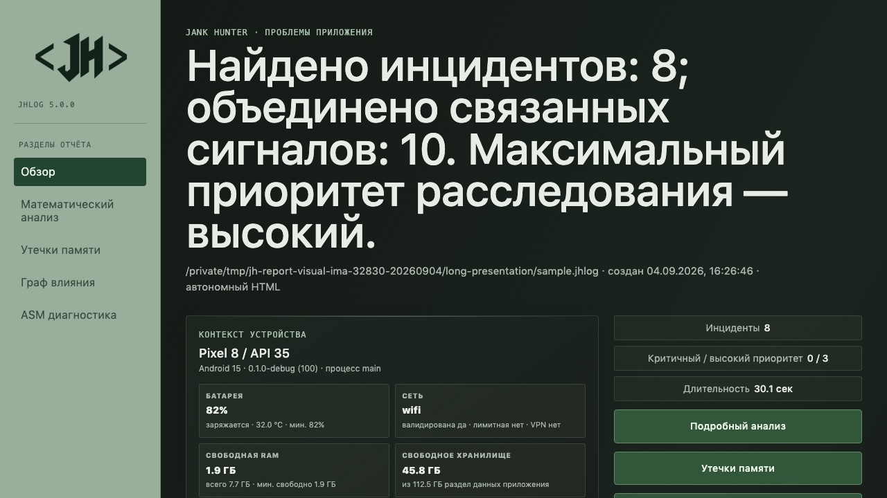

Матрица сигналов показывает задержки сети, рывки интерфейса, частоту кадров, паузы главного потока, память и краткий срез графа влияния.

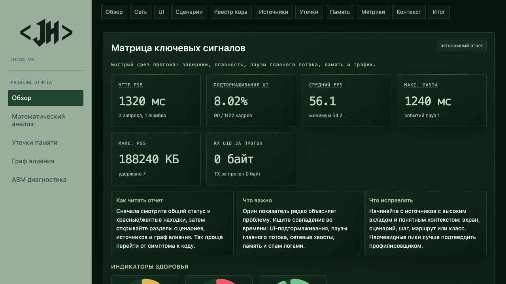

Раздел сценариев связывает экран, пользовательский путь, шаг, источник работы и симптомы. Это место, где фраза «где-то тормозит» наконец получает адрес прописки.

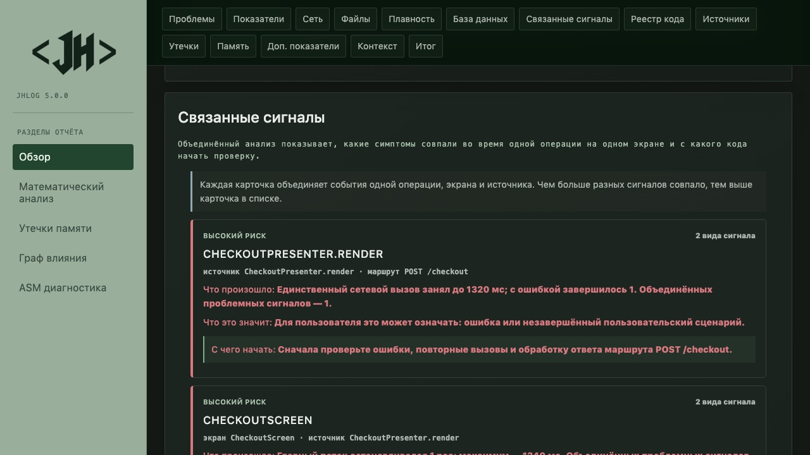

### Утечки Памяти

Вкладка «Утечки памяти» в `report.html` работает в лёгком режиме даже без дампа памяти. Сигнал жизни после задержки не называется доказанной утечкой. Если рядом есть `retained-*.hprof` или передан `--heap-dump`, отчёт отдельно показывает подтверждённый путь от корня сборщика мусора до удержанного объекта.

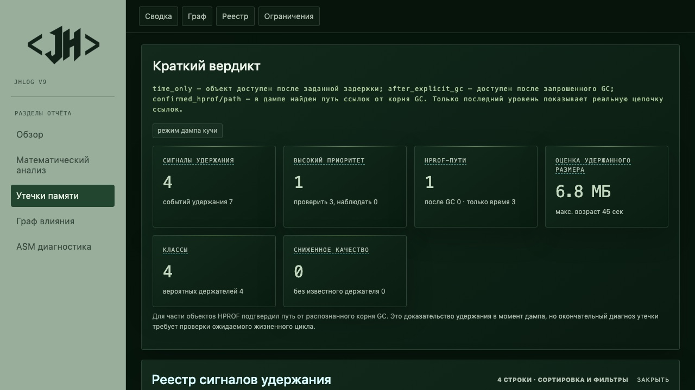

### Математический Разбор

Математическая страница не заменяет обычный отчёт, а помогает понять форму проблемы: качество данных, устойчивость распределений, точки изменения, повторяемость, накопленную нагрузку и статистические связи. Каждый раздел объясняет, что измерено, какие ограничения действуют и как проверить вывод.

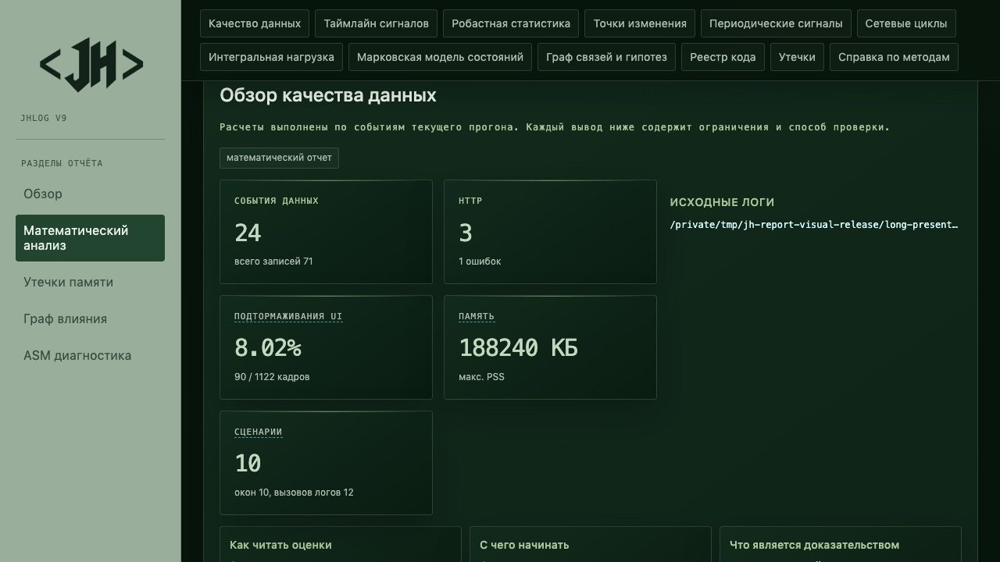

Сетевые циклы ищут только повторяющиеся маршруты и всплески с достаточной поддержкой данных. Слабые пики, похожие на спектральный шум, скрываются, а отсутствие измерений не превращается в нули.

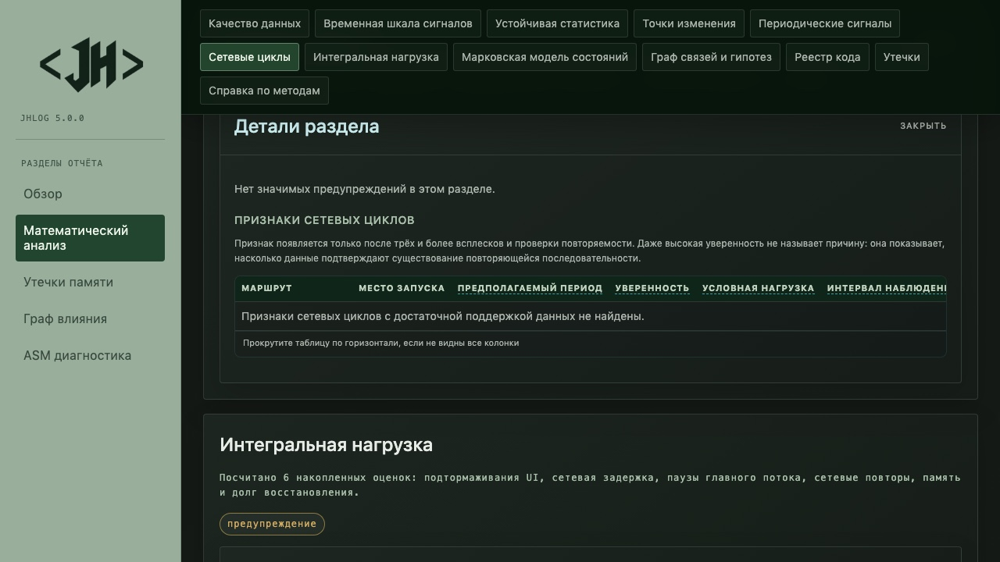

Интегральная нагрузка считает не только пик, но и превышение инженерного порога во времени: подтормаживания UI, сетевые хвосты, паузы главного потока, память и долг восстановления. Такие числа сравниваются только для сценариев сопоставимой длительности и одинакового числа прогонов.

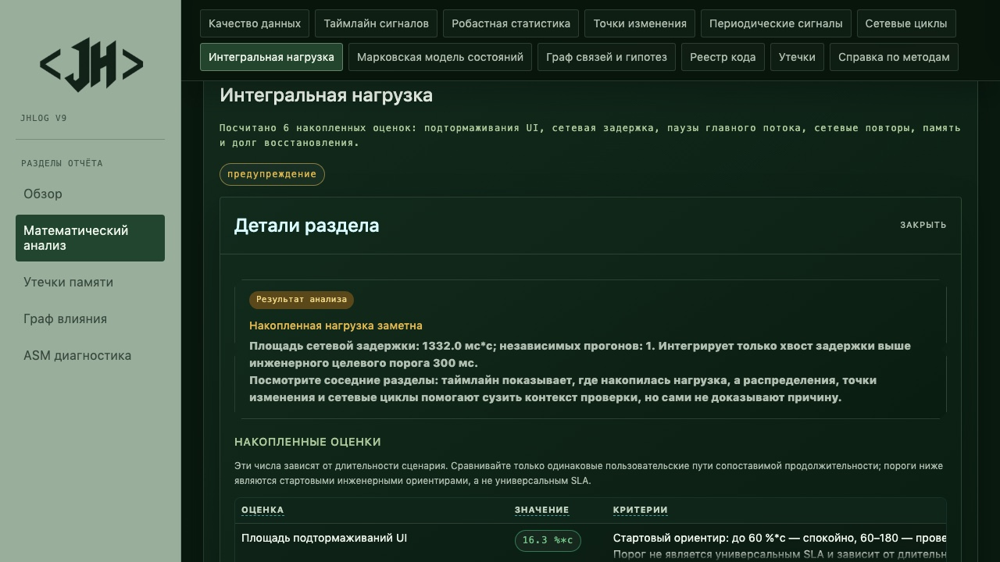

Марковская модель описывает наблюдавшиеся состояния приложения и осторожно оценивает траекторию одиночного прогона. При пропусках, слабом покрытии или объединении независимых запусков прогноз отключается вместо выдачи уверенного, но неподтверждённого ответа.

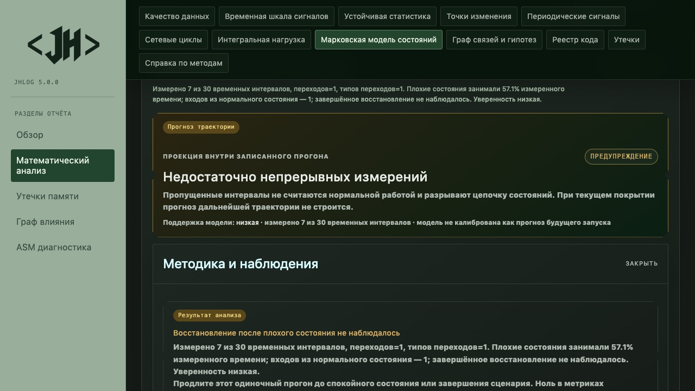

Граф связей и гипотез объединяет симптомы, маршруты, сеть, источники работ и экраны. Линия означает совместное наблюдение, а не направление вызова и не доказанную причину. Виновника нужно подтверждать сырыми событиями, трассировкой и кодом.

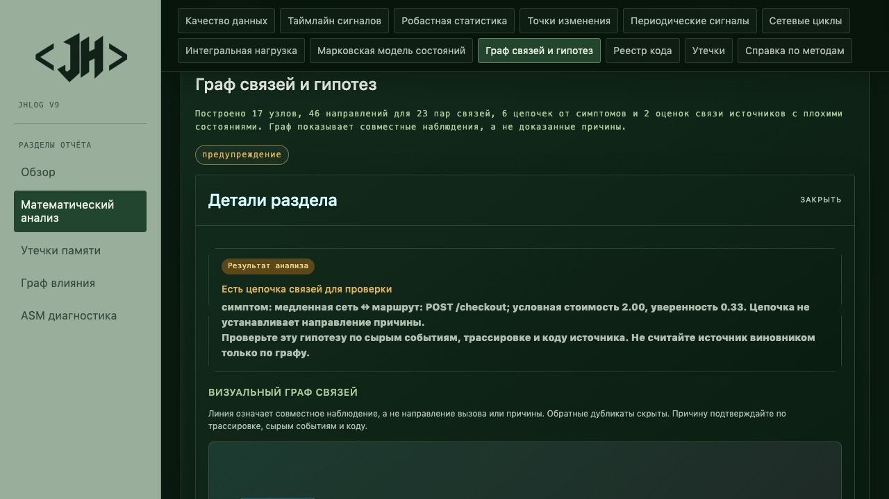

### Код, Внедрение И Сравнение

Граф влияния разделяет полный индекс связей и ограниченные интерактивные представления: «Проблемы», «Только выполнение», «Пакеты», «Окрестность» и «Экран / сценарий». В каждом режиме видны полные количества, фактически показанная часть и причины ограничения; поиск, глубина, направление и раскрытие пакета не пересчитывают исходную оценку риска.

Записанные, статические, смешанные, связующие и пакетные элементы различаются формой и стилем. Записанная связь означает наблюдавшийся вызов, статическая — только возможную связь по ASM-графу, а оценка служит для приоритизации расследования и не выдаётся за доказанную причину.

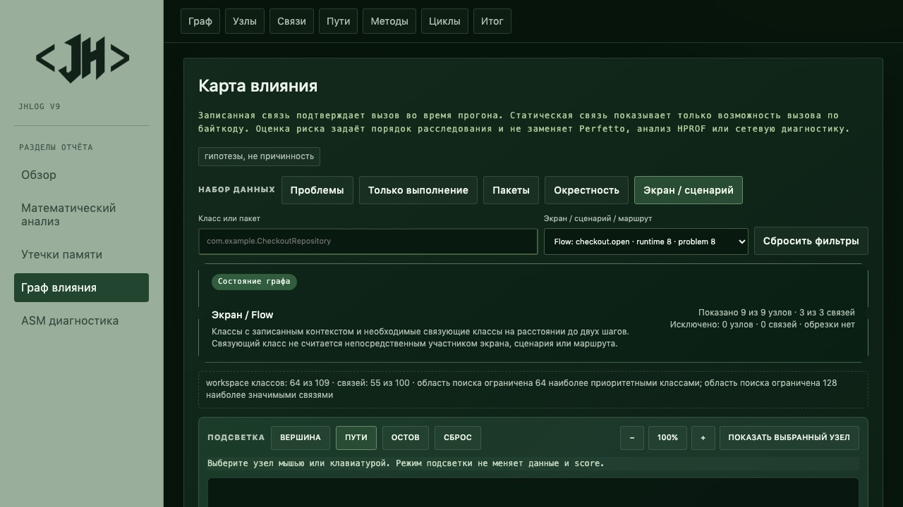

ASM-диагностика показывает, какие перехватчики реально совпали с байткодом, какие решения сопоставителя сработали и какие сигнатуры оказались неподдержанными.

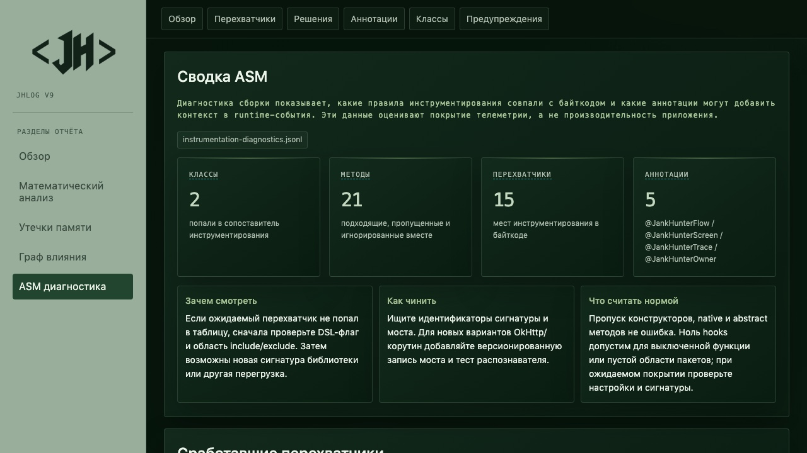

`compare` сравнивает базовый и проверяемый прогоны: задержки, плавность, память, трафик, удержанные объекты, когорты и проблемные классы. Частотные сигналы нормализуются по длительности, категориальный состав сравнивается по долям, а несопоставимые данные показываются как «нет данных».

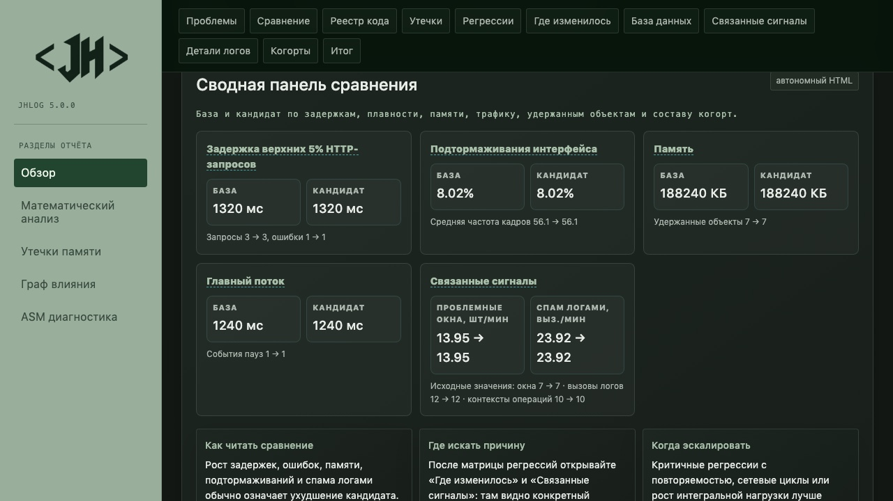

## Быстрый Старт

Соберите утилиту и создайте демонстрационный лог:

```bash
cd cli
make build
./bin/jankhunter sample --out /tmp/baseline.jhlog
./bin/jankhunter sample --out /tmp/candidate.jhlog
./bin/jankhunter inspect /tmp/baseline.jhlog --out /tmp/jankhunter-report.html
./bin/jankhunter compare --baseline /tmp/baseline.jhlog --candidate /tmp/candidate.jhlog --out /tmp/jankhunter-compare.html
```

`make build` использует установленный Go. Если Go не найден, Makefile скачает Go `1.22.12` в `cli/.tools/go` и не тронет системные каталоги. Текущая версия утилиты: `1.0.3`, формат `.jhlog`: `9`.

Установка команды:

```bash
cd cli
make install
make install PREFIX="$HOME/.local"
```

## Пример Android-Приложения

Для живой проверки можно запустить пример приложения:

```bash
./run-sample-app.sh
```

Скрипт найдёт устройство или запустит эмулятор, установит пример и даст команды:

```text
log
report
stop
open
help
quit
```

Команды `log`, `report` и `stop` забирают `.jhlog` через `adb run-as` и создают HTML-отчёт в `tmp/sample-app-.../pull-.../report.html`.

Пример приложения автоматически проходит единую цепочку экранов и создаёт контролируемые UI, CPU, network, memory, retention, GC и log-spam сигналы. Прежние отдельные действия вынесены в ручную лабораторию. С экрана результата или ручного режима можно отправить ZIP с `.jhlog` и включённым HPROF через системное меню «Поделиться».

## Подключение К Своему Приложению

Минимальное подключение обычно выглядит так:

```kotlin
import io.jankhunter.gradle.JankHunterFeatureMode

plugins {
    id("io.jankhunter.android") version "1.0.3"
}

dependencies {
    implementation("io.jankhunter:jankhunter-android-sdk:1.0.3")
}
```

`jankhunter-android-sdk` — единственная пользовательская dependency; runtime, annotations и
OkHttp/WebSocket support приходят транзитивно. По умолчанию ASM ограничен Android `namespace` и
явными include-пакетами. В application-модуле `includeWholeApplication = true` разрешает обработку
классов всех модулей и зависимостей итогового приложения:

```kotlin
jankHunter {
    enabledBuildTypes.add("debug")
    verboseLogs = false
    sessionLogSizeLimitEnabled = true
    maxSessionLogSizeMiB = 16
    // Отдельный build-time каталог Dagger/Hilt/Koin; по умолчанию DISABLED.
    dependencyInjectionAnalysis = JankHunterFeatureMode.DISABLED

    instrument {
        includeWholeApplication = false
        includePackages("com.myapp.feature", "com.myapp.data")
        excludePackages("com.myapp.generated", "com.myapp.di")
        handlers = true
        executors = true
        // Opt-in: добавляет wrapper-объекты на coroutine builders.
        coroutines = false
        flowInteractions = true
        logSpam = true
        classGraph = true
        // Глубокий runtime-граф — только для короткой целевой диагностики.
        runtimeCallGraph = false
    }
}
```

MainLooper `Printer` и coroutine ASM по умолчанию выключены. Для UI-кадров JankStats имеет
приоритет, а Choreographer работает только как fallback, поэтому один кадр не попадает в отчёт
дважды.

Каждая сессия сбора создаёт один файл `jh-session-log.YYYY-MM-DD.<index>.jhlog`.
Внутренний ограничитель по умолчанию включён и запечатывает файл при 16 МиБ; его можно
настроить через `sessionLogSizeLimitEnabled` и `maxSessionLogSizeMiB`. Лимит пользовательского
`JankHunterBinaryStorage` действует всегда, а встроенное хранилище держит до 64 МиБ закрытых
сессий. Process/session identity находится внутри заголовка `.jhlog v9`, а не в имени файла.

OkHttp/WebSocket hooks используют support из `jankhunter-android-sdk`; дополнительных зависимостей для них нет.

Без Gradle-плагина можно вручную подключить `jankhunter-runtime` и вызвать `JankHunter.init(...)`, но ASM-внедрения и автоматически сгенерированного `JankHunterAutoInitProvider` в таком режиме не будет.

Если нужно быстро подключить существующий проект на macOS:

```bash
scripts/integrate-android-project.sh ~/work/MyApp
```

С ограничением ASM и включённым графом вызовов времени выполнения:

```bash
scripts/integrate-android-project.sh \
  --target ~/work/MyApp \
  --module :app \
  --include-package com.myapp.feature \
  --include-package com.myapp.data \
  --exclude-packages com.myapp.generated,com.myapp.di \
  --runtime-call-graph
```

Скрипт публикует Android-модули Jank Hunter в `.jankhunter/maven`, собирает `jankhunter` в `.jankhunter/bin`, добавляет репозиторий в настройки Gradle, прописывает `sdk.dir`, подключает зависимости и создаёт `jankHunter { ... }`. Перед правками он кладёт копии изменяемых файлов в `.jankhunter-backups/`.

## Что Собирается

- HTTP: длительность, DNS, соединение, время до первого байта, ошибки, байты, маршрут и владелец работы.
- WebSocket: события через обёртку слушателя.
- Интерфейс: окна кадров, частота кадров, доля медленных кадров, экраны.
- Главный поток: длинные паузы, источники работ и подозрительные окна.
- Память: PSS, Java heap, native heap, свободная память, удержанные объекты и, при явном разрешении, HPROF.
- Устройство: Android, API, патч безопасности, ABI, сеть, VPN, батарея, хранилище, признак root-доступа.
- Пользовательские счётчики и числовые метрики.
- Атрибуция: `JankHunter.withOwner(...)`, `@JankHunterOwner`, `@JankHunterIgnore`, `@JankHunterScreen`, `@JankHunterFlow`, `@JankHunterTrace`.
- Граф влияния: классы, сценарии, проблемные окна, спам логами, связи времени выполнения и статический граф ASM.
- Диагностика внедрения: совпавшие перехватчики, пропуски, неподдержанные сигнатуры и области аннотаций.
- DI-каталог по явному opt-in: build-time связи Dagger/Hilt/Koin без runtime tracing generated-кода.

## Что Создаёт Утилита

Для одного прогона создаётся один самодостаточный файл:

```text
report.html
```

Для сравнения — также один файл:

```text
compare.html
```

Обзор, математический анализ, утечки и граф влияния встроены во вкладки этого HTML. Флаг
`--instrumentation-diagnostics` добавляет вкладку «ASM диагностика», а `--di-catalog` — вкладку
«DI-каталог». DI-связи не являются ссылками удержания или runtime-вызовами и не влияют на score,
severity, evidence, граф влияния или анализ утечек. Файл можно передавать отдельно: внешние ресурсы
и соседние HTML ему не нужны.

Отдельные команды:

- `inspect`: один лог или группа логов.
- `compare`: базовый прогон против проверяемого.
- `problems`: CSV или JSON с проблемными местами.
- `scorecard`: JSON-оценка готовности данных и сравнения.
- `export`: сырые события в JSONL.
- `size`: профиль размера `.jhlog`.
- `version`: версия утилиты и формат лога.

## Проверки

Командная утилита:

```bash
cd cli
make test
npm run visual-regression
```

Android:

```bash
cd android
./gradlew detekt :jankhunter-gradle-plugin:test :jankhunter-okhttp3:testDebugUnitTest :jankhunter-runtime:testDebugUnitTest :sample-app:assembleDebug --no-daemon
```

Проверка Gradle-плагина как внешнего потребителя:

```bash
scripts/gradle-plugin-smoke.sh
```

Сквозной прогон на устройстве или эмуляторе:

```bash
./scripts/android-e2e.sh
```

Он собирает пример приложения, запускает проверку на устройстве, забирает `.jhlog` и кладёт отчёт в `reports/android-e2e/report.html`.

## Релизы

GitHub Actions собирает релиз по тегу `v*` или вручную из действия `Release`:

```bash
git tag v1.0.3
git push origin v1.0.3
```

В выпуск попадают:

- архив локального Maven-репозитория с отдельными артефактами runtime, annotations, опциональной OkHttp-интеграции, Gradle-плагина и маркера плагина.
- `jankhunter_<version>_darwin_amd64.tar.gz`: утилита для macOS Intel.
- `jankhunter_<version>_darwin_arm64.tar.gz`: утилита для macOS Apple Silicon.
- `checksums.txt`: суммы SHA-256.

## Принципы

- Высокочастотные данные пишутся агрегатами, а не потоком мелких событий.
- Всё тяжёлое включается явно: ASM, дампы памяти, расширенные перехватчики и релизные сборки.
- Отладочный прогон должен быть полезным без сервера и без особой церемонии.
- Отчёт должен вести от симптома к месту в коде. Если он просто говорит «всё плохо», это не отчёт, а пацак без гравицапы.
