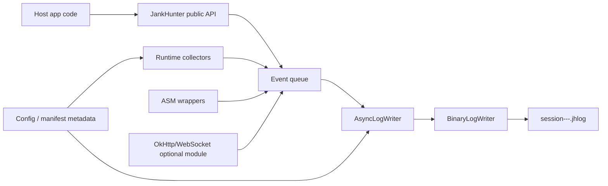
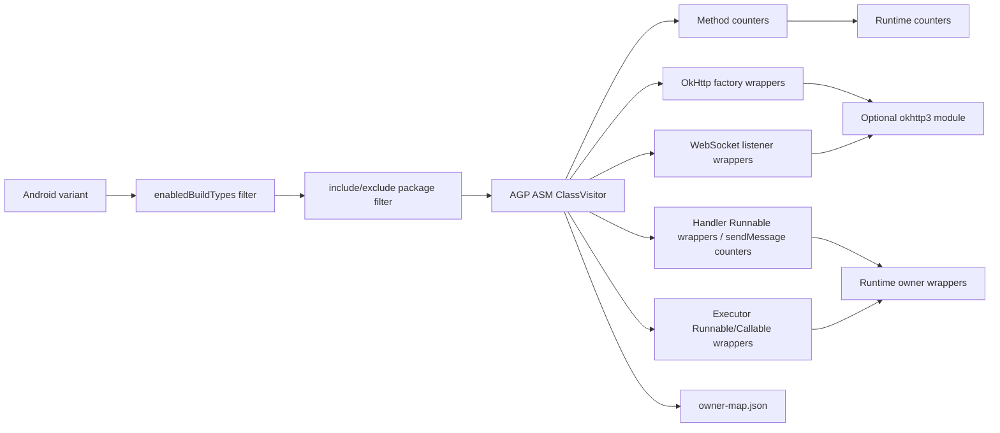
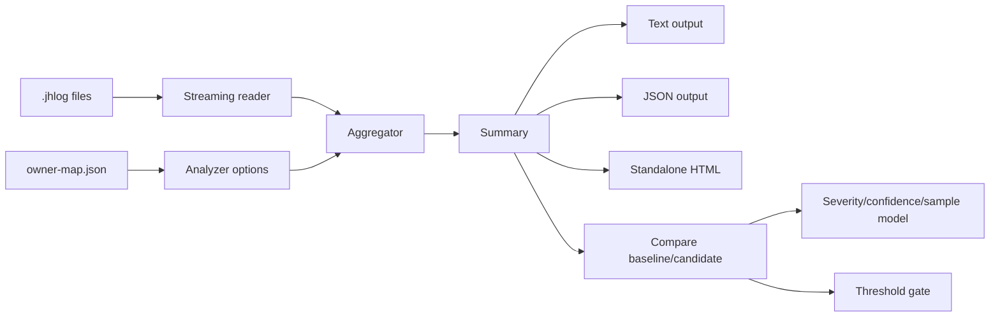

# Jank Hunter Architecture

## Overview

Jank Hunter has two execution surfaces:

- Android SDK: conservative in-app collection and local `.jhlog` writing.
- Go CLI: offline decoding, aggregation, comparison, JSON export, CI gating, and standalone HTML reports.

The Android side runs inside host applications, so stability and dependency hygiene win over metric completeness. The CLI runs after collection, so it can perform heavier aggregation and reporting without adding runtime risk to the app.

## Repository Layout

```text
android/
  jankhunter-runtime/        Core Android SDK, Kotlin-only, no AndroidX/OkHttp runtime dependency
  jankhunter-okhttp3/        Optional OkHttp 3 integration, compileOnly OkHttp
  jankhunter-gradle-plugin/  Build-time Gradle plugin and ASM instrumentation
  sample-app/                Local dogfooding app
cli/
  cmd/jankhunter/            CLI entrypoint
  internal/jhlog/            Binary/JSONL log reader and writer
  internal/analyze/          Streaming aggregation, compare, thresholds
  internal/report/           Standalone HTML renderer
docs/
  architecture.md            System architecture
  release.md                 Release and publishing process
```

## Module Boundaries

`jankhunter-runtime` is the dependency-safe core:

- Kotlin-only Android sources;
- no AndroidX, OkHttp, RxJava, Compose, coroutines, or app-startup dependency;
- auto-init through a `ContentProvider`;
- local queue, binary writer, collectors, owner API, retained-object watcher, and reflection-only JankStats bridge.

Optional integrations are separate artifacts:

- `jankhunter-okhttp3` wraps OkHttp `EventListener.Factory` and `WebSocketListener`;
- build-time instrumentation lives in `jankhunter-gradle-plugin`;
- additional host-specific integrations should stay outside core unless they are dependency-free.

## SDK Data Flow



High-frequency sources aggregate before enqueueing. UI frames become `ui_window` records, counters are summed by name, and gauges are written as compact metric events. This keeps disk writes bounded.

## Event Format

`.jhlog` is a compact append-only binary format:

```text
magic/version
record*

record:
  event_type: uvarint
  timestamp_delta_ms: uvarint
  flags: uvarint
  payload_len: uvarint
  payload: event-specific uvarints/strings
```

String-heavy values are dictionary encoded:

- owner labels;
- routes;
- screens;
- class names;
- stack hints;
- metrics;
- app version/build/device/process metadata.

Compatibility rules:

- readers tolerate old session payloads without process metadata;
- new optional payload fields are appended to preserve old data;
- existing field order is not changed;
- format version is bumped only when old readers cannot safely skip the change.

## Threading Model

Android runtime components use a small number of clear ownership rules:

- public API calls are cheap and enqueue events into a bounded queue;
- `AsyncLogWriter` owns file IO and rotation on a background executor;
- main-thread watchdog and `Choreographer` callbacks observe UI latency but write aggregates;
- samplers run on background scheduling and avoid blocking the main thread;
- `flush()` is best-effort and intended for QA/test boundaries;
- `shutdown()` stops collectors, flushes, and closes lifecycle-owned JankStats handles.

When the queue is full, the runtime drops events instead of blocking the host app and records dropped-event counters when possible.

## Multi-Process Model

Process name resolution:

1. `Application.getProcessName()` on API 28+.
2. `ActivityManager.runningAppProcesses` by PID.
3. `context.packageName` fallback.

Policy is evaluated before the writer starts:

- `mainProcessOnly` permits only the package-name process;
- `allowedProcesses` permits an explicit raw process list;
- `processNameRedactor` changes persisted metadata and filenames but not policy matching.

Each process writes a separate namespace:

```text
session-main-<timestamp>-<segment>.jhlog
session-remote-<timestamp>-<segment>.jhlog
```

The CLI reports process breakdown and adds process-mix deltas during compare.

## Attribution Model

Jank Hunter reports likely suspects rather than perfect blame:

- explicit owners via `JankHunter.withOwner`;
- generated owner labels from ASM call sites;
- wrapper-level duration/failure metrics for `Runnable` and `Callable`;
- stack hints only for slow/error paths where the signal is worth the cost.

Owner-map seed files live at:

```text
build/generated/jankhunter/<variant>/owner-map.json
```

The CLI accepts `--owner-map` and resolves direct labels, `jh:<hash>` IDs, and `#hash` suffixes.

## Gradle Instrumentation Flow



Instrumentation is opt-in by build type and per-hook flag. Method counters are off by default because they can be noisy. OkHttp/WebSocket hooks require the optional `jankhunter-okhttp3` artifact in the host app.

## UI and JankStats Model

`FpsMonitor` is the universal fallback:

- dependency-free `Choreographer` callback;
- per-screen window aggregates;
- frame count, jank count, p50/p95/p99, average/min FPS in CLI.

The JankStats bridge is reflection-only:

- no AndroidX dependency in core;
- manual install returns a handle;
- `jankStatsEnabled` enables lifecycle auto-install when AndroidX JankStats is already present;
- data is recorded as `jankstats.*` counters/gauges so reports do not double-count `ui_window` frames.

## Retained-Object Model

The retained-object watcher is a lightweight signal, not a heap analyzer:

- stores weak references and safe class/owner labels;
- checks once after `retainedObjectDelayMs`;
- optionally requests lightweight GC for debug/QA;
- checks again before reporting;
- groups by class/owner and writes count plus max age.

It never records `object.toString()`, fields, heap dumps, headers, bodies, tokens, or user data.

## CLI Report Flow



`inspect` and `compare` stream files instead of loading every event into memory. The analyzer keeps bounded maps and duration samples needed for p95/route/screen/owner reporting.

Compare includes:

- performance deltas;
- sample size;
- confidence level;
- approximate interval where useful;
- app version, SDK, device, process, network, and combined cohort mix warnings;
- CI threshold evaluation through `--thresholds`.

## Overhead Model

Runtime overhead is controlled by:

- bounded event queue;
- aggregate-first collectors;
- opt-in ASM hooks;
- build-type gating;
- slow-path gauges for wrapped work;
- sampled/limited stack hints;
- local file IO on a background thread;
- log rotation by byte size.

Default guidance:

- use runtime collectors broadly in debug/QA;
- enable OkHttp/WebSocket hooks when the optional artifact is present;
- enable Handler/Executor hooks for investigation windows;
- enable method counters only with narrow `includePackages`;
- keep release usage explicit and limited.

## Privacy Model

Privacy defaults:

- route redaction strips query strings and common identifiers;
- no request/response headers or bodies are recorded;
- object watcher avoids `toString()` and heap contents;
- process names can be redacted before persistence;
- owner names should be stable code labels, not user data.

Sensitive host-specific labels should be redacted before they enter runtime APIs.

## Extension Points

Supported extension points:

- `JankHunterConfig` builder and manifest metadata;
- custom route redactor;
- process name redactor;
- explicit owner scopes;
- custom counters/gauges;
- optional integration modules;
- Gradle plugin hook flags and include/exclude filters;
- CLI owner maps;
- CLI thresholds config.

New runtime integrations should be dependency-isolated unless they can be implemented through Android platform APIs or reflection without pulling host-conflicting libraries into core.

## Release and Distribution

Version is centralized in `android/gradle.properties`.

Android artifacts use Maven publishing metadata and optional signing through environment variables. CLI releases are built with `cli/Makefile`, which produces macOS/Linux archives and checksums.

See [release.md](release.md) for the release process and `.jhlog` compatibility policy.
