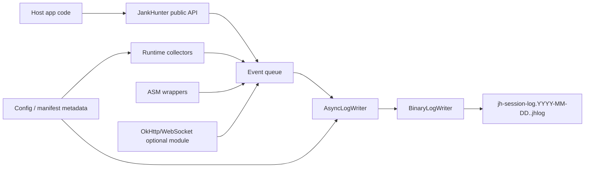
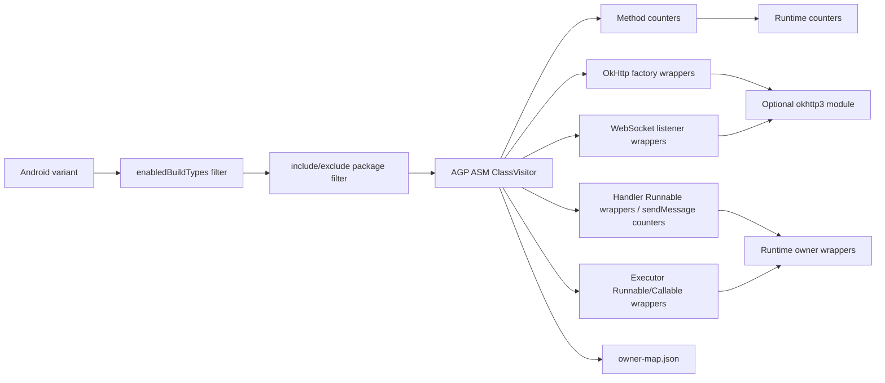
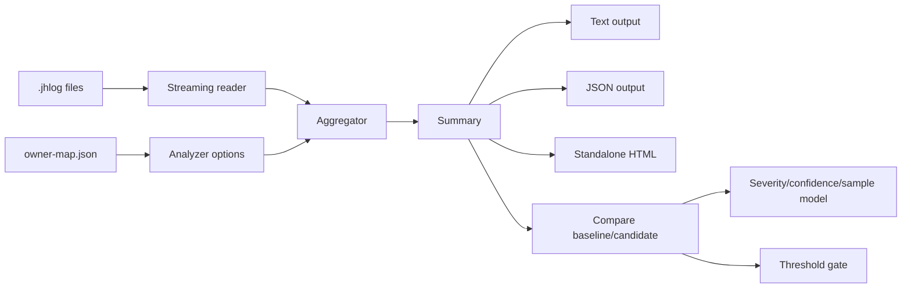

# Jank Hunter Architecture

## Overview

Jank Hunter has two execution surfaces:

- Android SDK: conservative in-app collection and local `.jhlog` writing.
- Go CLI: offline decoding, aggregation, comparison, JSON export, CI gating, and standalone HTML reports.

The Android side runs inside host applications, so stability and dependency hygiene win over metric completeness. The CLI runs after collection, so it can perform heavier aggregation and reporting without adding runtime risk to the app.

## Repository Layout

```text
android/
  jankhunter-runtime/        Core Android SDK, Kotlin-only, no AndroidX/OkHttp runtime dependency
  jankhunter-okhttp3/        Optional OkHttp 3 integration, compileOnly OkHttp
  jankhunter-gradle-plugin/  Build-time Gradle plugin and ASM instrumentation
  sample-app/                Local dogfooding app
cli/
  cmd/jankhunter/            CLI entrypoint
  internal/jhlog/            Binary/JSONL log reader and writer
  internal/analyze/          Streaming aggregation, compare, thresholds
  internal/report/           Standalone HTML renderer
docs/
  architecture.md            System architecture
  release.md                 Release and publishing process
```

## Module Boundaries

`jankhunter-runtime` is the dependency-safe core:

- Kotlin-only Android sources;
- no AndroidX, OkHttp, RxJava, Compose, coroutines, or app-startup dependency;
- auto-init through a `ContentProvider`;
- local queue, binary writer, collectors, owner API, retained-object watcher, and reflection-only JankStats bridge.

Optional integrations are separate artifacts:

- `jankhunter-okhttp3` wraps OkHttp `EventListener.Factory` and `WebSocketListener`;
- build-time instrumentation lives in `jankhunter-gradle-plugin`;
- additional host-specific integrations should stay outside core unless they are dependency-free.

## SDK Data Flow



High-frequency sources aggregate before enqueueing. UI frames become `ui_window` records, counters are summed by name, and gauges are written as compact metric events. This keeps disk writes bounded.

## Event Format

`.jhlog v9` is a chunked, append-only pre-release binary format:

```text
file header: magic/version + bounded identity payload + CRC32
committed chunk*:
  fixed header: codec/final flags, sequence, stored/raw sizes, record count, raw CRC32
  independently raw or gzip-compressed payload
  commit trailer mirroring sequence, sizes, and CRC32

record:
  length-delimited envelope
  type + envelope flags
  optional signed producer-time delta, producer thread, atomic attribution, attributes
  event-specific SymbolRef/uvarint payload
```

Producer time is captured before bounded-queue admission. Signed microsecond deltas permit events from different threads to reach the writer out of timestamp order. Time and `SAME_CONTEXT` state reset at every chunk boundary, and every record is length-delimited so a current reader can skip future record types safely. Context booleans such as low-memory, metered, validated, VPN, and the rooted-device signal stay in the event-attribute bitmask. Battery temperature uses signed zigzag-varint because sub-zero Celsius values are valid data.

A chunk is readable only after its complete commit trailer, mirrored metadata, decompression, size, record count, and CRC checks succeed. Copying an active file is therefore safe: a partial next header, payload, or trailer is an `open_with_tail` snapshot, while invalid committed bytes remain corruption. A clean terminal chunk contains exactly the latest quality snapshot and `SEGMENT_END`.

Metric payloads keep enough aggregation metadata for CLI-side merges:

```text
counter: metric_id, value, count=1, sum=value, max=value, mode=UNKNOWN
gauge:   metric_id, value, count, sum, max, mode
```

Gauge `mode` prevents semantically different signals from being averaged together:

- `AVERAGE` for numeric gauges where weighted average and max are meaningful;
- `LAST` for IDs, last levels, core counts, and max snapshots where the newest value is the only useful aggregate;
- `STATE` for enum/state gauges such as battery status, plugged, health, thermal status, process exit reason, and trim level;
- `BOOLEAN_RATE` for boolean gauges where the report value is the percentage of `true` samples.

The CLI merges Android-side metric windows by `sum/count` for `AVERAGE`, by latest value for `LAST`/`STATE`, and by true-count percentage for `BOOLEAN_RATE`. Negative custom gauges are rejected by the runtime and surfaced through the cumulative `invalid_metric_total` quality counter; signed values need a typed event or an explicitly signed context field.

String-heavy values are dictionary encoded:

- owner labels;
- routes;
- screens;
- class names;
- stack hints;
- metrics;
- app version/build/device metadata;
- static device snapshot values such as Android release, security patch, CPU ABI, and hardware identifiers.

Each dictionary definition carries `kind`, local id, encoding, byte length, and data. The Android writer currently emits bounded UTF-8 values (`encoding=0`). Event payloads reference them through typed `SymbolRef` values; stable build-time symbols use the namespace stored in the file header and are never collapsed into an ambiguous local id.

Pre-release format policy:

- until the project explicitly freezes the log format, `.jhlog` is allowed to change without backward-compatible readers;
- CLI readers target only the current pre-release `FormatVersion`;
- once the format is frozen, compatibility rules will switch to append-only payload changes and backward-compatible readers for released versions.

## Threading Model

Android runtime components use a small number of clear ownership rules:

- public API calls are cheap and enqueue events into a bounded queue;
- `AsyncLogWriter` owns one append-only file per collection session, size sealing, and cyclic retention on a background executor;
- main-thread watchdog and `Choreographer` callbacks observe UI latency but write aggregates;
- samplers run on background scheduling and avoid blocking the main thread;
- `flush()` is best-effort and intended for QA/test boundaries;
- `shutdown()` stops collectors, flushes, and closes lifecycle-owned JankStats handles.
- `setRuntimeEnabled(false, reason)` is a dynamic feature-flag gate: it flushes, stops collectors, closes the writer, and keeps the application context/config so diagnostics can be re-enabled without app restart.

When the queue is full, the runtime drops events instead of blocking the host app and records dropped-event counters when possible.

## Multi-Process Model

Process name resolution:

1. `Application.getProcessName()` on API 28+.
2. `ActivityManager.runningAppProcesses` by PID.
3. `context.packageName` fallback.

Policy is evaluated before the writer starts:

- `mainProcessOnly` permits only the package-name process;
- `allowedProcesses` permits an explicit raw process list;
- `processNameRedactor` changes persisted header metadata but not policy matching; canonical filenames never contain process names.

Filenames deliberately contain no process name:

```text
jh-session-log.2026-07-14.41.jhlog
jh-session-log.2026-07-14.42.jhlog
```

The local date is fixed when collection starts; the decimal index is monotonic and never reused. Run, process, and session identity lives in the v9 header. The CLI reads that identity from file contents, reports the process breakdown, and adds process-mix deltas during compare.

## Attribution Model

Jank Hunter reports likely suspects rather than perfect blame:

- explicit owners via `JankHunter.withOwner`;
- generated owner labels from ASM call sites;
- wrapper-level duration/failure metrics for `Runnable` and `Callable`;
- stack hints only for slow/error paths where the signal is worth the cost.

Owner-map seed files live at:

```text
build/generated/jankhunter/<variant>/owner-map.json
```

The CLI accepts `--owner-map` and resolves direct labels, `jh:<hash>` IDs, and `#hash` suffixes.

## Gradle Instrumentation Flow



Instrumentation is opt-in by build type and per-hook flag. Method counters are off by default because they can be noisy. OkHttp/WebSocket hooks require the optional `jankhunter-okhttp3` artifact in the host app.

Instrumentation matching is split into explicit extension points:

- `MethodCall` describes the bytecode call site.
- `SignatureSpec` and `VersionedInstrumentationBridge` map old/new library signatures to stable `HookIntent` values.
- `InstrumentationModule` is the Chain of Responsibility unit; modules own enablement, priority and bridge families.
- `InstrumentationBridgeProvider` feeds bridge families into the registry, so a new library/signature family does not require rewriting resolver plumbing.
- `BytecodeCommand` objects perform stack/local mutations, keeping emit logic outside the matcher.
- `ArtifactSchemas` versions owner-map, class-graph and instrumentation-diagnostics outputs.

Adding a new OkHttp/coroutine/Handler signature should normally mean adding a signature variant to the bridge family, not editing every hook helper by hand.
Diagnostics records matched hooks plus disabled/unsupported/skipped decisions, which makes DSL gates and unknown signatures visible in `report-diagnostics.html`.

## UI and JankStats Model

`FpsMonitor` is the universal fallback:

- dependency-free `Choreographer` callback;
- per-screen window aggregates;
- frame count, jank count, p50/p95/p99, average/min FPS in CLI.

The JankStats bridge is reflection-only:

- no AndroidX dependency in core;
- `jankStatsEnabled` enables lifecycle-owned auto-install when AndroidX JankStats is already present;
- the bridge is internal and feeds the same `FpsMonitor` window aggregator as the fallback;
- JankStats owns an active window while it is resumed; `Choreographer` resumes only when no tracked window is active, so frames and metrics cannot be duplicated.

## Retained-Object Model

The retained-object watcher is a lightweight signal, not a heap analyzer:

- stores weak references and safe class/owner labels;
- stores the watch-time screen/flow/step context, but not object fields or stringified object state;
- deduplicates repeated watch calls for the same live object, so overlapping lifecycle callbacks and ASM hooks do not inflate retained counts;
- checks once after `retainedObjectDelayMs`;
- optionally requests lightweight GC for debug/QA;
- checks again before reporting;
- groups by class/owner and writes count plus max age.
- automatically watches Activity destroy through dependency-free application callbacks.
- can be fed by ASM lifecycle leak hooks for Fragment/ViewModel/View/Dialog/Service methods without adding AndroidX to runtime core.
- `onDestroyView` lifecycle hooks observe the current Fragment view and likely binding/view fields before cleanup, which makes clean code disappear naturally after retained-delay and leaks stay visible.

It never records `object.toString()`, fields, heap dumps, headers, bodies, tokens, or user data.

Heap-backed leak analysis intentionally stays on the CLI side. The Android runtime may save bounded HPROF artifacts in debug/QA builds, but it does not parse heap object graphs in-process. The CLI links runtime retained classes to HPROF/evidence, classifies GC roots, computes a normalized chain fingerprint, keeps alternative reference paths, estimates retained size/count, and renders the standalone leak report. This keeps host app risk low while allowing heavier offline diagnostics.

## CLI Report Flow



`inspect` and `compare` stream files instead of loading every event into memory. The analyzer keeps bounded maps and duration samples needed for p95/route/screen/owner reporting.

The CLI command surface is registered through command objects in `cmd/jankhunter`, while analyzers stay in `internal/analyze`. Artifact loaders validate schema versions up front. Influence analysis builds class and method graph indexes, then computes relevant edges, multi-hop shortest explanation paths, method hotspots, SCC cycles and hot paths for the standalone graph report. Leak analysis is also offline: `report-leaks.html` works from runtime retained signals, while heap-enhanced mode uses HPROF/heap evidence to render a GC-root reference graph and compare leak fingerprints as new/worse/same/better/resolved.

Compare includes:

- performance deltas;
- sample size;
- confidence level;
- approximate interval where useful;
- app version, SDK, device, process, network, and combined cohort mix warnings;
- CI threshold evaluation through `--thresholds`.

## Overhead Model

Runtime overhead is controlled by:

- bounded event queue;
- aggregate-first collectors;
- opt-in ASM hooks;
- build-type gating;
- slow-path gauges for wrapped work;
- sampled/limited stack hints;
- local file IO on a background thread;
- terminal sealing of the current session file at `maxSessionLogBytes`, without rollover or recovery into a continuation file;
- cyclic retention of older sealed sessions by `maxSessionLogsBytes`, while the active file remains protected.

Default guidance:

- use runtime collectors broadly in debug/QA;
- enable OkHttp/WebSocket hooks when the optional artifact is present;
- enable Handler/Executor hooks for investigation windows;
- enable method counters first with narrow `includePackages`; for very large apps use explicit `includeWholeApplication`
  only in debug/QA and keep noisy packages in `excludePackages`;
- keep release usage explicit and limited.

## Privacy Model

Privacy defaults:

- route redaction strips query strings and common identifiers;
- no request/response headers or bodies are recorded;
- object watcher avoids `toString()` and heap contents;
- process names can be redacted before persistence;
- owner names should be stable code labels, not user data.

Sensitive host-specific labels should be redacted before they enter runtime APIs.

## Extension Points

Supported extension points:

- `JankHunterConfig` builder and manifest metadata;
- custom route redactor;
- process name redactor;
- explicit owner scopes;
- custom counters/gauges;
- optional integration modules;
- Gradle plugin hook flags and include/exclude filters;
- CLI owner maps;
- CLI thresholds config.

New runtime integrations should be dependency-isolated unless they can be implemented through Android platform APIs or reflection without pulling host-conflicting libraries into core.

## Architecture Evolution

Future SDK extension work should make instrumentation easier to grow without adding brittle descriptor checks to a single large visitor. The target direction is a rule pipeline built from small, testable parts:

- `MethodCall` for bytecode call-site facts;
- `SignatureSpec` plus `ArgumentRole` for old/new library signatures;
- `HookIntent` for the canonical meaning of an instrumentation point;
- `BytecodeCommand` for safe stack/local-variable mutations;
- `InstrumentationRule` and explicit rule priority for hook dispatch;
- bridges and factories for integration families such as OkHttp, coroutines, Handler and Executor;
- gates and diagnostics for fail-open unsupported signatures;
- mergeable CLI aggregators and bounded graph analysis for large logs.

The full implementation prompt and phased checklist live in [sdk-architecture-evolution-prompt.md](sdk-architecture-evolution-prompt.md).

## Release and Distribution

Version is centralized in `android/gradle.properties`.

Android artifacts use Maven publishing metadata and optional signing through environment variables. CLI releases are built with `cli/Makefile`, which produces macOS/Linux archives and checksums.

See [release.md](release.md) for the release process and `.jhlog` compatibility policy.
