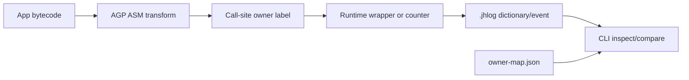

# Jank Hunter Architecture

## Overview

Jank Hunter has two independent execution surfaces:

- Android SDK: low-overhead collection and local log writing.
- Go CLI: offline decoding, aggregation, comparison, and report generation.

The Android side must stay conservative because it runs inside somebody else's app.
The CLI side can do heavier analysis because it runs after the fact.

## Repository layout

```text
cli/      Go CLI and report generator.
android/  Runtime SDK, optional integrations, sample app, and Gradle plugin.
docs/     Format and architecture notes.
```

## Android module strategy

`jankhunter-runtime` is the dependency-safe core. Android source is Kotlin-only and avoids AndroidX/OkHttp/RxJava/Compose in the core artifact.

Optional integrations are separate artifacts:

- `jankhunter-okhttp3` for OkHttp EventListener integration.
- Additional integration artifacts can be added for RxJava, Compose, coroutines, or host-specific frameworks without changing core runtime dependencies.

This avoids forcing host apps to upgrade libraries.

## Log strategy

Runtime writes compact binary `.jhlog` records:

- varint encoding for integers;
- bit flags for common booleans;
- dictionary IDs for names;
- windowed aggregates for high-frequency metrics.

The CLI owns human-readable rendering.

## Attribution strategy

Jank Hunter should not claim perfect blame. It should surface likely suspects:

- explicit owners from `JankHunter.withOwner`;
- generated owner IDs from Gradle/ASM instrumentation;
- sampled stack signatures for slow/error paths;
- top offenders grouped by route, screen, class, owner, and stack.

## Gradle Instrumentation

The Gradle plugin uses Android Gradle Plugin ASM APIs to weave enabled debug/QA variants after include/exclude package filtering.

- `methodCounters` records method-entry counters with deterministic owner labels.
- `okhttp` wraps `OkHttpClient.Builder.eventListenerFactory(...)` with `JankHunterEventListenerFactory`.
- `webSockets` wraps `OkHttpClient.newWebSocket(...)` listeners with `JankHunterWebSocketListener`.
- `handlers` wraps a safe subset of `Handler` Runnable scheduling and counts `sendMessage*` call sites.
- `executors` wraps JDK Executor/ExecutorService Runnable and Callable work while preserving return/exception behavior.
- Each enabled variant emits `build/generated/jankhunter/<variant>/owner-map.json` with hook policy and an `owners` schema for downstream enrichment.

Release builds should receive either a noop runtime or a deliberately lightweight opt-in runtime.


